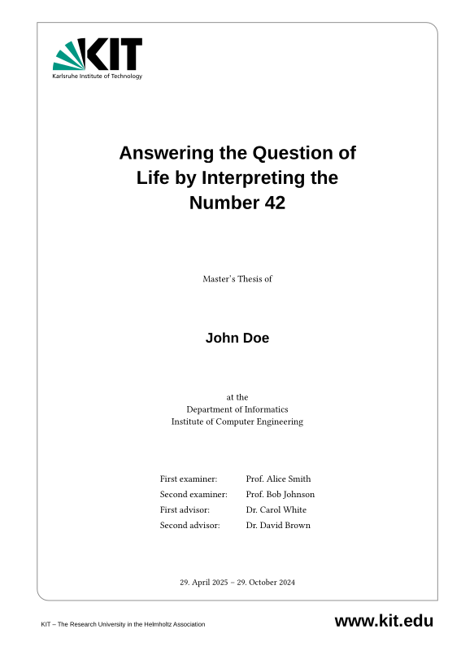

# KIT Thesis

An (unoffical) template for writing a thesis at the [Karlsruhe Institute of Technology (KIT)](https://www.kit.edu/) using [Typst](https://typst.app/).

> Based on https://github.com/eneoli/kit-thesis-template.

TLDR: Run `make` and open `thesis.pdf`.

## Features

- KIT corporate design
- Generation of SVG line plots (`.line-plot.svg`) from CSVs (`.line-plot.csv`) using Python/matplotlib in the [`assets/`](./assets/) directory
- Generation of basic statistics (`.stats.csv`) from CSVs (`.line-plot.csv`) data using Python/pandas including mean, median, standard deviation, min, max, and count
- Generation of Typst tables from CSV data, for example to show computed statistics
- Conversion of draw.io PDF exports to SVG for embedding in Typst (see [Tips & Tricks](#tips-and-tricks))
- Bibliography management using BibTeX (see [`references.bib`](./references.bib))
- Macros for showing ToDo blocks (`#todo-block[text]`) and ToDo footnotes (`#todo[text]`)
- Makefile for easy building and watching for changes
- Example chapters to get you started quickly
- Inline author citations using `#cite(<SOURCE>, form: "author")` powered by a [custom cite style](./lib/cite-style-inline-max-3-authors.csl) ensures that inline citations have a maximum of 3 authors before using "et al."

## Usage

1. Install [Typst](https://typst.app/), [matplotlib](https://pypi.org/project/matplotlib/) and [pandas](https://pypi.org/project/pandas/) for Python
2. Fill your data in [`metadata.toml`](./metadata.toml)
3. Write your thesis text in the corresponding files for each chapter in [`chapters/`](./chapters/)
4. Add your references to [`references.bib`](./references.bib) (BibTeX format)
5. Add your figures, CSV data and draw.io-generated PDFs to the [`assets/`](./assets/) directory
6. Run `make watch` to auto-build on changes or `make build` to build once, and open `thesis.pdf`

## Tips and Tricks

- **Inline author citations**: `#cite(<SOURCE>, form: "author")` lists the authors. A [custom cite style](./lib/cite-style-inline-max-3-authors.csl) ensures that inline citations have a maximum of 3 authors before using "et al.".
- **DOI hyperlink bug**: If a citation contains a DOI, the first part of the link (i.e. the `https://doi.org/`) is clickable. If the DOI is removed and a URL is used instead, the URL is shown and is fully clickable.
- **Labels**: To better organize labels and avoid naming conflicts, consider using labels with their category and section, i.e. `<sec:SECTION>`, `<fig:SECTION:FIGURE>`, `<tab:SECTION:TABLE>`.
- **Draw.io figures**: If you want to use [draw.io](https://draw.io) to create figures, export them as PDF (not as SVG) and put them in the [`assets/`](./assets/) directory. The Makefile automatically converts them to SVG for embedding in Typst. Trying to export SVGs directly from draw.io and embedding them in Typst leads to black boxes instead of the actual figure.

## License

The [KIT logo](./lib/KIT_Logo.svg) is property of the [Karlsruhe Institute of Technology (KIT)](https://kit.edu) and is used according to the [KIT Corporate Design Guidelines](https://kit-cd.km.kit.edu). The rest of the code in this repository is licensed under the [MIT-0 License](./LICENSE).
